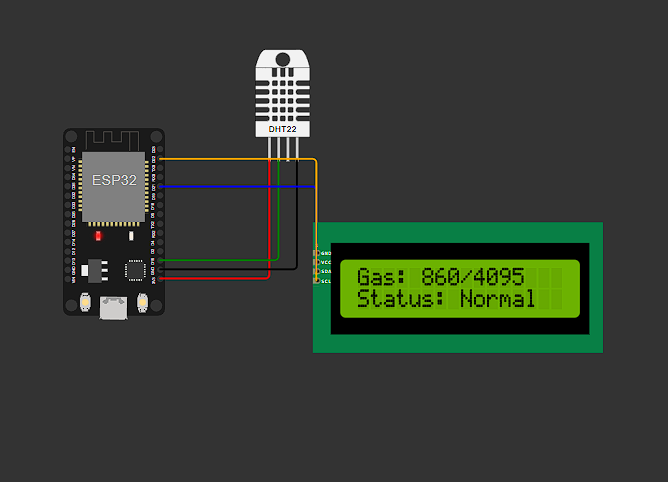
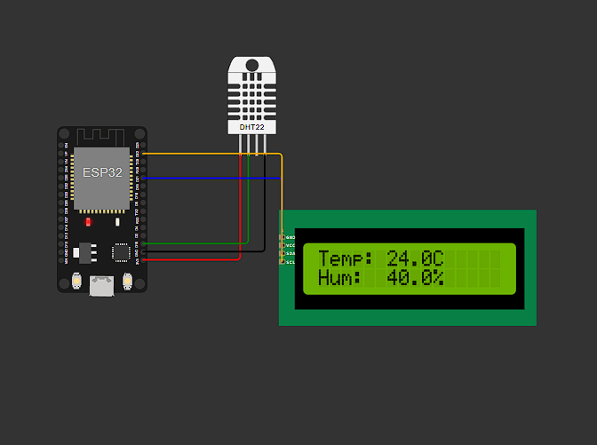
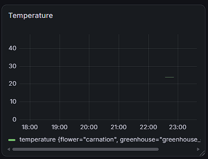
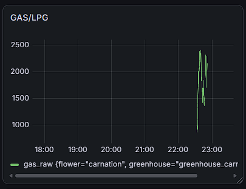
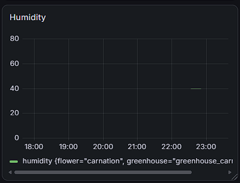
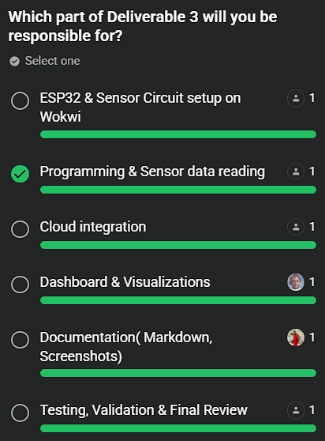

**ICS 4111: Embedded Systems & IoT, Semester Project**

**Deliverable 3: Transmit and Visualise Sensor Data on Cloud Platforms**

**Group Flower Assignment:** Carnations **Farm:** Flora Farms, Naivasha, Kenya

**1. Overview**

This deliverable extends our Deliverable 2 embedded device design into a full end-to-end IoT pipeline: sensor data is now transmitted from the ESP32 to InfluxDB Cloud (time-series storage) and visualised on a Grafana dashboard, so that Sheila and other stakeholders at Flora Farms can remotely monitor greenhouse conditions for the carnation greenhouse.

**Device architecture (per spec):**

| **Component**                                        | **Role**                                                       |
|------------------------------------------------------|----------------------------------------------------------------|
| ESP32                                                | Microcontroller, WiFi connectivity, HTTP client to InfluxDB    |
| DHT22                                                | Temperature & humidity (carnation growth conditions)           |
| MQ-5 *(simulated as MQ-2 in Wokwi , see note below)* | LPG / combustible gas detection (greenhouse LPG heater safety) |
| 16x2 I2C LCD                                         | On-site live readout for greenhouse staff                      |

**Note on the gas sensor:** Wokwi's simulator does not provide a dedicated MQ-5 part, so we used the wokwi-mq2-gas-sensor part as a stand-in. The MQ-2 detects the same family of combustible gases (LPG, propane, methane) via the same analog-voltage interface as the MQ-5, so all wiring, code, and thresholds transfer directly to real MQ-5 hardware without modification.

**2. Why These Metrics? (Carnation Growth + Farm Context)**

Carnations (*Dianthus caryophyllus*) grow best in:

-   **Temperature:** 18-22°C (growth stress above \~27°C; risk of stunted growth and increased disease susceptibility below \~10°C)
-   **Relative humidity:** 60-70% (excess humidity promotes fungal disease such as *Botrytis* / grey mould, a major cut-flower crop risk)

Since Flora Farms' greenhouses are heated with **LPG**, we also monitor combustible gas concentration as a **safety** metric, an LPG leak near the heater is a fire/health hazard independent of flower growth conditions, and is exactly the kind of remote-monitoring value stakeholders like Sheila (based in Nairobi, away from the physical greenhouses) need visibility into.

**3. Prototype**

**Type:** Simulated (Wokwi) **Public Wokwi project link:**

https://wokwi.com/projects/469455948638270465

Files in this repo (/wokwi-carnation-monitor/):

-   sketch.ino - ESP32 firmware (sensor reading, LCD display, InfluxDB write)
-   diagram.json - Wokwi wiring diagram
-   libraries.txt - required Arduino libraries

**Wiring summary**

| **From (ESP32)** | **To**             | **Notes**                                    |
|------------------|--------------------|----------------------------------------------|
| 3V3              | DHT22 VCC          |                                              |
| GND              | DHT22 GND          |                                              |
| GPIO 15          | DHT22 DATA         |                                              |
| 5V/VIN           | MQ-2(sim MQ-5) VCC |                                              |
| GND              | MQ-2(sim MQ-5) GND |                                              |
| GPIO 34          | MQ-2(sim MQ-5) AO  | ADC1 channel , safe to read with WiFi active |
| 5V/VIN           | LCD VCC            |                                              |
| GND              | LCD GND            |                                              |
| GPIO 21          | LCD SDA            | I2C                                          |
| GPIO 22          | LCD SCL            | I2C                                          |

**How the sketch works**

1.  Connects to WiFi (Wokwi-GUEST network in simulation).
2.  Every 5 seconds: reads DHT22 (temp/humidity) and MQ-5/MQ-2 (analog gas reading), evaluates them against carnation-growth and LPG-safety thresholds, and pushes a line-protocol point to InfluxDB Cloud via HTTPS POST to /api/v2/write.
3.  The LCD rotates every 3 seconds between an environmental screen (temp/humidity) and a gas/alert screen, so on-site staff have an immediate local readout even without checking the dashboard.

    

    

**4. Cloud Storage Setup , InfluxDB Cloud**

1.  Created a free **InfluxDB Cloud** account and organisation (IoT).
2.  Created a bucket named flora_farms_greenhouse to store all sensor data as a time-series.
3.  Generated an **API token** (Load Data → API Tokens → Generate Token) with write access scoped to this bucket, and copied it into the sketch's INFLUX_TOKEN constant (rotated/revoked prior to final submission , see security note below).
4.  Recorded our InfluxDB Cloud region URL (https://us-east-1-1.aws.cloud2.influxdata.com) into INFLUX_URL.
5.  Data is written using the InfluxDB v2 **line protocol** format directly over HTTP (no external client library needed , keeps the Wokwi build dependency-free):
6.  greenhouse_sensors,greenhouse=greenhouse_carnation_01,flower=carnation
7.  temperature=20.10,humidity=64.5,gas_raw=512,gas_voltage=0.412,
8.  temp_ok=true,humidity_ok=true,gas_alert=false
    -   **measurement:** greenhouse_sensors
    -   **tags:** greenhouse, flower (support filtering across groups if buckets are shared across the class)
    -   **fields:** temperature, humidity, gas_raw, gas_voltage, temp_ok, humidity_ok, gas_alert

**Verification:** Data was confirmed flowing end-to-end using Grafana's **Explore** view against the flora_farms_greenhouse bucket, which returned a live temperature series tagged flower="carnation", greenhouse="greenhouse_carnation_01" , confirming the ESP32 → WiFi → HTTPS POST → InfluxDB Cloud write path works correctly.

**5. Visualisation , Grafana Dashboard**

We connected Grafana Cloud to our InfluxDB Cloud bucket as a data source (Flux query language, InfluxDB 2.x / TSM product) and built a dashboard with the following panels (dashboard JSON provided in grafana-dashboard.json for reference/import):

1.  **Temperature over time** (time-series line chart, 18-22°C optimal carnation range).
2.  **Relative humidity over time** (time-series line chart, 60-70% optimal range).
3.  **LPG/gas sensor reading over time** (time-series line chart, raw ADC value against the safety alert threshold).
4.  **Current conditions gauge** - snapshot of the latest temperature value for at-a-glance status.

**Grafana dashboard link:** https://ivoryhippo1867.grafana.net/d/iv4zfvg/temperature?orgId=1&from=now-6h&to=now&timezone=browser&refresh=auto

**Dashboard screenshot(s):**

5.  **Groupwork Evidence**

    ****

**Group members:**

-   Gichana Ivan
-   Gitahi Mathenge
-   Nick Njuru
-   James Muthama
-   Stacy Akinyi
-   Chelsea Savayi
